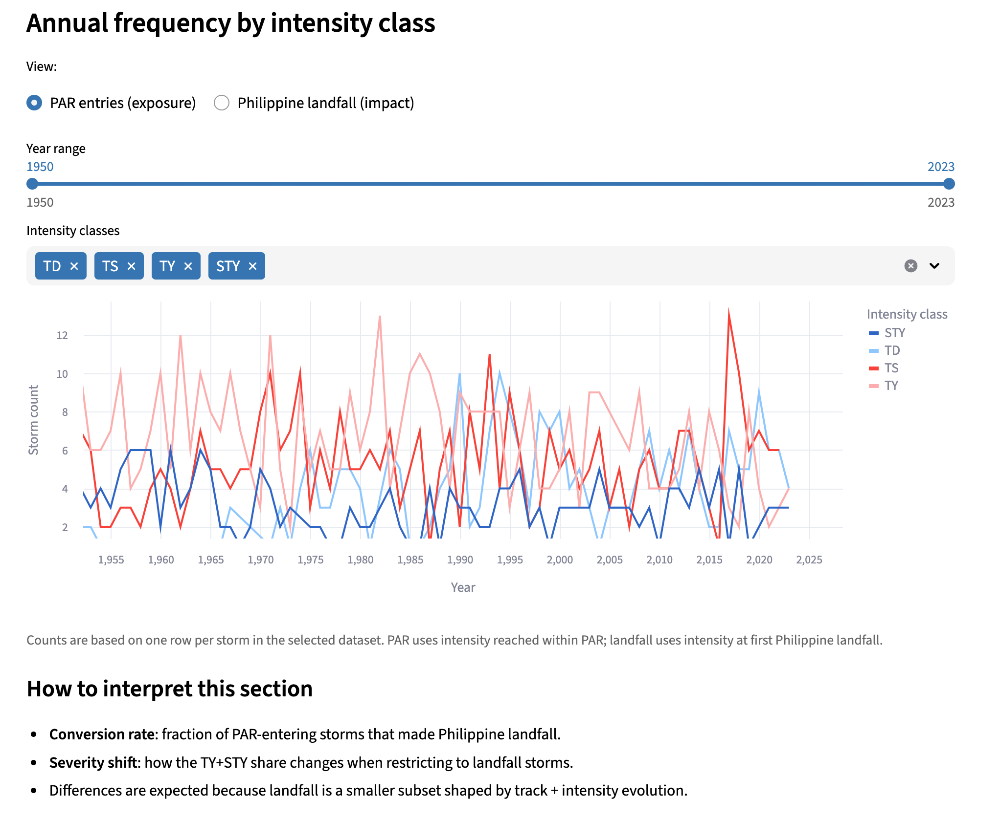
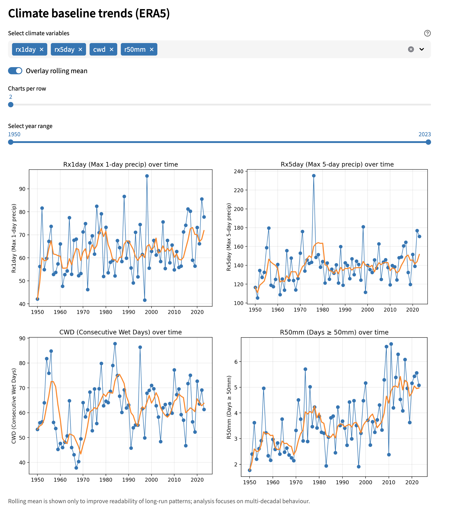
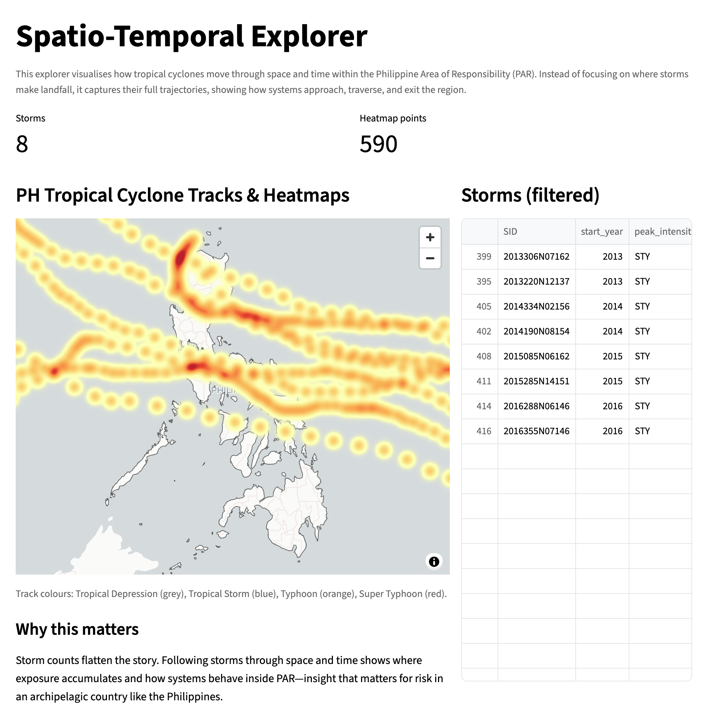

# 1. Introduction, Scope and Context

Preview

## 1.1 Introduction 

The Philippines is located in one of the most active typhoon belts in the world. With warm ocean waters and a position near the equator, typhoons occur regularly. On average, twenty tropical cyclones enter the **Philippine Area of Responsibility (PAR)** every year.

In this project, the Philippines is considered a single island system (despite being an archipelago nation with over 7,000 islands) that is frequently hit by storms. Unlike other researches that focus on specific storms, this project investigates long-term trends and how climate factors affect typhoon behavior.

I lived in the Philippines for 13 years and survived Super Typhoon Haiyan at the age of seven. The disaster hit my small hometown of Tacloban City in 2013 and resulted in over 10,000 deaths. It is because of this experience that this project has a special significance to me; although pertaining strong subjective views due to my lived experiences, I, however, will take an objective approach with the use of data science to view broader patterns through two main tropical cyclone and climate datasets.

## 1.2 Purpose

The aim of the project is to determine the frequency of typhoons that occur within the Philippines and the intensity that is reached based on the climate that prevails. The project aims to establish the patterns that emerge from the data on typhoons, rainfall, and climate.

Typhoons cause an average annual economic loss of around $3.5 billion in the Philippines, according to the World Bank. Understanding these patterns is therefore important for public safety and economic resilience.

*Side point*: Forecasting was initially planned as part of this project, but implementing robust predictive models would have significantly expanded the scope and exceeded the available time. As a result, this project is designed as a foundational analysis that can be extended in future work to develop forecasting approaches for early warning, disaster preparedness, and risk planning.

## 1.3 Scope

This dashboard focuses on historical tropical cyclone activity affecting the Philippines between 1950 and 2023, using two complementary perspectives: *exposure* and *impact*.

Specifically, the dashboard includes:

- Tropical cyclones associated with the Philippines, identified through:

    - storms that enter the Philippine Area of Responsibility (PAR), and

    - storms that make landfall in the Philippines, treated as the subset most relevant to direct societal impact;

- Spatio-temporal patterns of typhoon activity, allowing users to explore how storm frequency, intensity, and geographic distribution vary across time and space;

- Climate drivers related to rainfall, derived from ERA5 reanalysis data, including measures of total precipitation and rainfall extremes.

Storm intensity is represented using *maximum sustained wind speed*, which provides a consistent and widely used metric across the full historical record. Climate conditions are described using rainfall-based variables, reflecting the primary hazard mechanism through which typhoons cause flooding and damage in the Philippines.

Other climate factors, such as temperature or atmospheric circulation patterns, are acknowledged but fall outside the scope of this dashboard due to data availability, interpretability, and project constraints.

## 1.4 Limitations

The analysis works at a yearly level. Short-term changes and seasonal patterns are not shown, and important features within individual typhoon seasons may be smoothed out.

The results describe association, not cause. A relationship between climate variables and storm activity does not mean one directly drives the other. Many physical processes are not modelled here.

The behaviour of the storms is also simplified. Although the storms are classified depending on their exposure and landfall, other variables such as the tracks and angles of the storms are not considered.

Another consideration I then noted was that data quality varies across time. This is because earlier records are likely less complete and less accurate than modern observations, reflecting changes in monitoring and reporting.

Taken together, these limitations mean the findings point to broad patterns rather than precise or causal conclusions.

## 1.5 Primary Data Sources

There are two primary data sets:

1. [IBTrACS](https://www.ncei.noaa.gov/data/international-best-track-archive-for-climate-stewardship-ibtracs/v04r01/access/csv/ibtracs.WP.list.v04r01.csv) tropical cyclone records, which include storm paths and wind speed-based intensity information.

2. Using [ERA5](https://climateknowledgeportal.worldbank.org/download-data) reanalysis data, rainfall and rainfall extremes.
(Data scope = Countries, Country of Focus = PH, Collection = era5-x0.25)

Collectively, these data sources make possible a consistent and repeatable analysis of typhoon exposure and climate factors that impact the Philippines.

# 2. Methodology and Data Analysis

## 2.1 Data Preparation and Cleaning

Two datasets are used: historical tropical cyclone records and climate reanalysis data.

Tropical cyclone data were sourced from IBTrACS and filtered to include storms between 1950 and 2023. Track-level records were cleaned to retain consistent identifiers, timestamps, geographic coordinates, storm nature, and maximum sustained wind speed. Track points were aggregated by storm identifier to derive storm-level summaries such as duration and peak intensity.

A polygon representing the Philippine Area of Responsibility (PAR) was used to spatially filter cyclone tracks, allowing storms to be classified as entering PAR. To identify storms that made landfall in the Philippines, cyclone tracks were intersected with a Philippines GeoJSON boundary, enabling separation between regional exposure (PAR entry) and direct national impact (landfall).

Climate data were obtained from ERA5 reanalysis products accessed via the World Bank Group Climate Change Knowledge Portal, provided as annual time-series for the Philippines. Due to platform constraints, only three variables could be extracted per request. As a result, the nine climate variables were downloaded across three separate extractions, producing three CSV files. These were then consolidated into a single dataset by matching observations on year, ensuring all climate variables were temporally aligned with the storm data.

All data preparation steps were implemented using modular Python scripts and tracked using version control to support reproducibility.

## 2.2 Handling Missing and Incomplete Data

Data completeness varies across the historical record.

Earlier cyclone observations contain fewer track points and less reliable intensity estimates. These limitations were retained rather than corrected or imputed, as adjusting early data risked introducing artificial trends. Analyses therefore focus on robust metrics such as storm counts, broad intensity categories, and long-term patterns.

ERA5 climate data were largely complete. Any isolated missing values introduced during dataset merging were handled through omission on a per-analysis basis. No interpolation was applied, as the dashboard is exploratory rather than predictive.

## 2.3 Analytical Methods

The analysis uses descriptive and comparative methods to explore patterns in typhoon activity and climate conditions.

Storm activity is analysed using annual frequencies, wind-based intensity classifications, and spatial summaries derived from track data. Climate drivers are examined using annual rainfall totals and extreme precipitation indices, which are compared against storm metrics using time-series and comparative visualisations.

Interactive spatial and temporal visualisations allow users to explore differences between storms entering PAR and those making landfall. The methods prioritise clarity and interpretability, supporting insight without overextending beyond the limitations of the data.

# 3. Design and Implementation

## 3.1 Systems Architecture and Project Structure

The project is organised around a clear separation of concerns: raw data, processed data, cleaning pipelines, and dashboard application code.

- Data storage

    - *data/raw/* contains original inputs (IBTrACS exports, ERA5 CSV extracts, and geographic boundaries).

    - *data/processed/* contains cleaned and analysis-ready datasets:

        - *data/processed/IBTrACS/* stores PAR-filtered and landfall-filtered outputs (versioned folders).

        - *data/processed/era5/merged_era5_data.csv* stores the consolidated climate dataset.

- Geospatial boundaries

    - The Philippines boundary is stored as GeoJSON (e.g., *data/assets/geo/philippines.geojson*) and used for landfall checks.

    - PAR entry is computed using a polygon approach (polygon vertices from Philippine Atmospheric, Geophysical and Astronomical Services Administration (PAGASA)) in preprocessing.

- Data pipelines

    - *cleaning scripts/* contains scripts that convert raw sources into reproducible processed outputs (IBTrACS cleaning, ERA5 consolidation).

- Application code

    - *src/pages/* contains Streamlit pages (multi-page app layout).

    - *src/visualisations/* contains plot and rendering functions so visuals are reusable and not duplicated across pages.

    - *src/core/* contains shared constants/utilities used across the app.

This structure keeps the project maintainable, supports debugging, and makes it clear which files are inputs, outputs, and application logic.

## 3.2 Dashboard Structure

The dashboard is implemented as a multi-page Streamlit app, structured around the main user journey:

- Overview and Provenance
    Introduces the problem context, datasets, key definitions (PAR vs landfall), and how to interpret intensity categories.

- Spatio-Temporal Explorer
    Provides interactive exploration of storm tracks and patterns over time, allowing users to compare broader exposure (PAR) against direct impact (landfall).

- Climate Drivers
    Focuses on rainfall-related climate variables (merged ERA5 annual indices) and how they vary alongside storm frequency and intensity over the historical period.

- Documentation and Conclusion
    Definining key definitions, justifying dashboard choices, and reflecting on the project. 

This page structure is intentionally minimal and story-driven: context first, then exploration, then drivers.

## 3.3 Interactivity

Interactivity is built into each page to support different user needs (quick insight vs deeper investigation). Key controls include:

- Time filters (e.g., selecting a year range)

- Storm filters (e.g., intensity groupings and PAR vs landfall subsets)

- Hover/tooltips and dynamic charts to inspect exact values and specific storms

- Responsive layout choices so visuals remain readable across different screen sizes

- This ensures the dashboard behaves like a true data product: users can interrogate the data rather than passively view static plots.

## 3.4 Version Control and Deployment

Version control was used throughout development to track changes, demonstrate authorship, and support reproducibility. The project was developed in a structured Git repository with regular commits capturing incremental updates to data processing, visualisation, and interface logic.

The dashboard is deployed using Streamlit and hosted at https://phtyphoons.streamlit.app
It is intended for desktop and laptop use and is not optimised for mobile devices. 

The application entry point is src/Overview.py, which initialises the dashboard and defines the page structure.

# 4. Conclusions and Reflection

# 4.1 Conclusions

This dashboard examined long-term typhoon exposure and rainfall extremes in the Philippines by separating storms that enter the Philippine Area of Responsibility from those that make landfall. This distinction matters. Many storms pass through the region, but only a subset translate into direct national impact, and that subset shows a different intensity profile.

Spatio-temporal analysis reveals persistent storm corridors rather than uniform risk, while climate driver analysis suggests that years with more storms tend to coincide with stronger rainfall extremes. These relationships are exploratory, not causal, but they provide important context for understanding how typhoon activity and rainfall extremes vary together over time.

# 4.2 Reflection

Having survived Super Typhoon Haiyan in 2013, this project holds personal meaning. As a child, typhoons felt sudden and isolated. Working with decades of data reframed that experience, placing individual events within longer patterns of exposure, recurrence, and variability.

The project also highlighted that effective time and scope management is an area of ongoing development. Forecasting models were initially planned but were removed due to limited time available for proper implementation and validation. This resulted in a narrower scope and a focus on descriptive analysis, reinforcing the importance of realistic planning and prioritisation in future work.

With the project, I acquired hands-on experience with large typhoon and climate datasets. I was able to learn about the process of preparing and merging IBTrACS cyclone datasets, applying polygon filters, and incorporating ERA5 climate datasets from the World Bank Group Climate Change Knowledge Portal. I was also able to work with GeoJSON datasets, create data workflows, and visualize complex datasets.

These skills provide a good foundation for me to develop from. In the future, my aim is to enhance the dashboard with more accurate time data and sophisticated analysis, beginning with the current typhoon and climate data streams. This project helped to further develop my passion for data analysis and geospatial applications in real-world climate risk and disaster responses.
